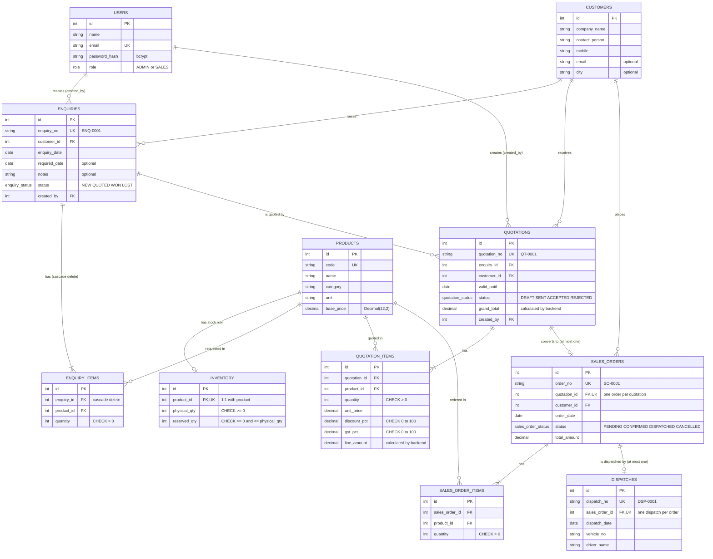
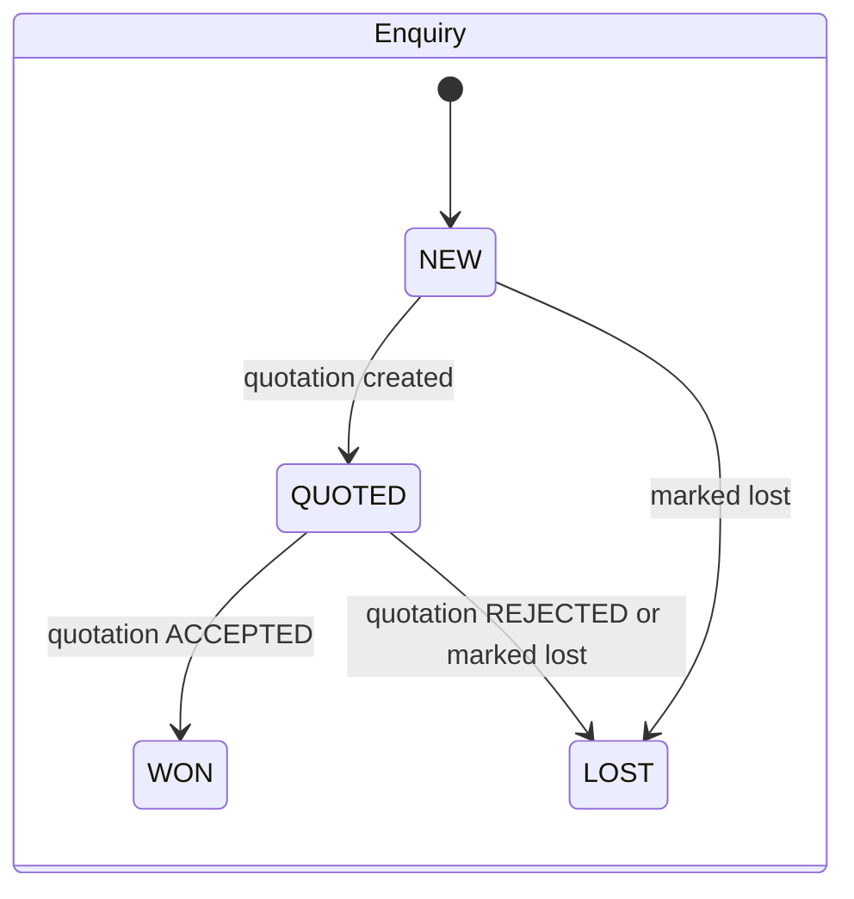
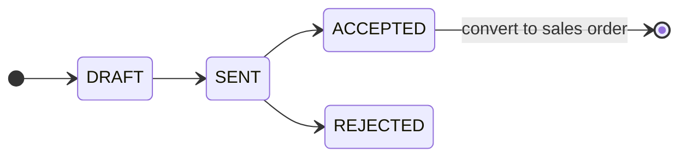
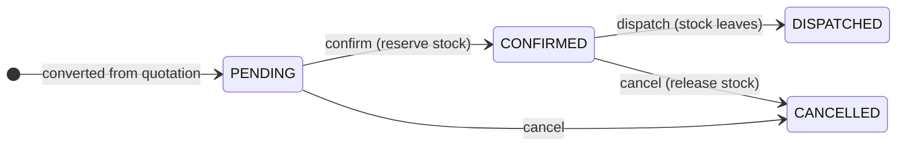

# ER Diagram

Generated from `backend/prisma/schema.prisma`. Column names are exactly the same in PostgreSQL, Prisma, the JSON API and React.
`PK` primary key, `FK` foreign key, `UK` unique. Money is `Decimal(12,2)`, percentages `Decimal(5,2)`.

## Rules the database enforces by itself

| Constraint | Table.column | What it guarantees |
|---|---|---|
| UNIQUE | `sales_orders.quotation_id` | One quotation can create at most one sales order, even if two requests race |
| UNIQUE | `dispatches.sales_order_id` | An order can only have one dispatch record |
| UNIQUE | `inventory.product_id` | Exactly one stock row per product |
| UNIQUE | `users.email`, `products.code`, `*_no` document numbers | No duplicates |
| CHECK | `inventory.physical_qty >= 0`, `reserved_qty >= 0` | Stock can never go negative |
| CHECK | `inventory.reserved_qty <= physical_qty` | Never reserve more than exists |
| CHECK | `quantity > 0` on enquiry, quotation and sales order items | No zero or negative lines |
| CHECK | `discount_pct` and `gst_pct` between 0 and 100 | Sensible percentages |
| FOREIGN KEY | every `*_id` column | No line without its parent record |

Available quantity is not a column. It is always computed as `physical_qty - reserved_qty` by `getAvailable` in `backend/src/services/product.service.js`.

## Status flows

